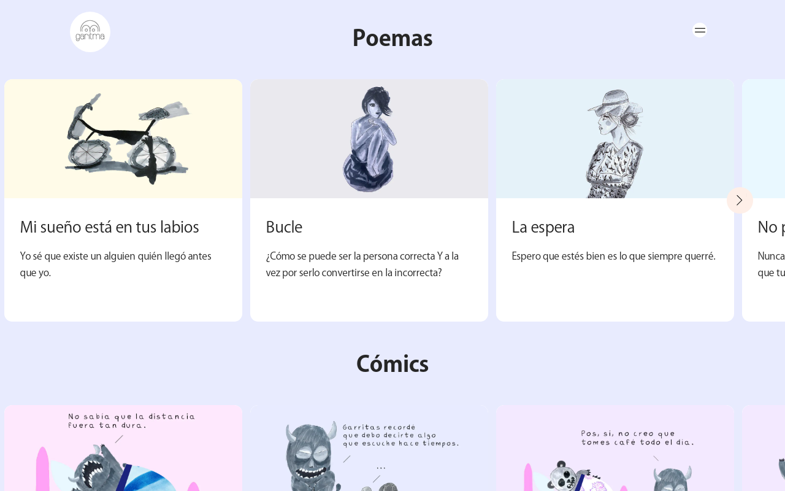

# App de arte y entretenimiento de Garitma

App de arte y entretenimiento con CMS Prismic.io y Next JS.

## ¿Cómo funciona?

Requiere Node.JS 10

- `npm install` para instalar las dependencias.
- `npm run dev` para el entorno de desarrollo
- `npm run build && npm start` para el entorno de producción.

## Licencia

MIT
